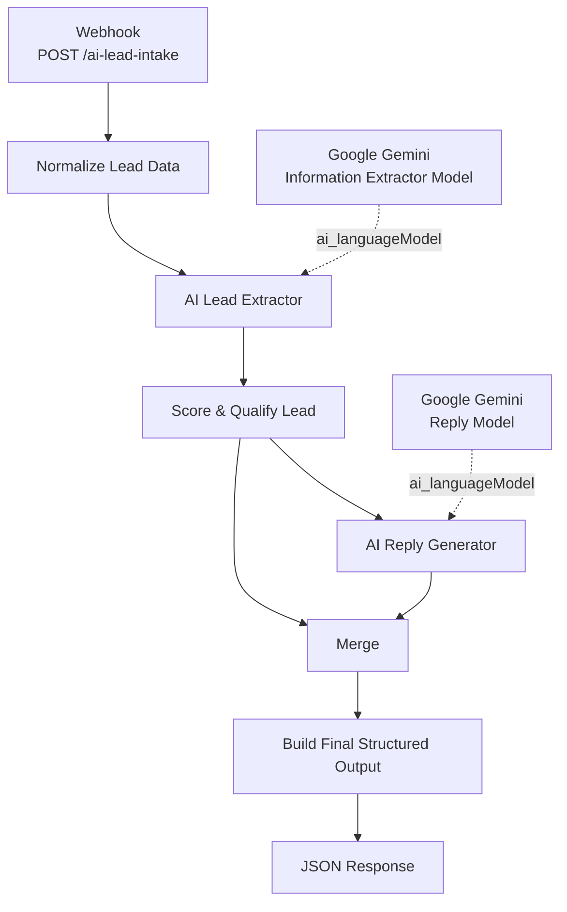

# Workflow Architecture

```mermaid
flowchart TD

A["Webhook<br/>POST /ai-lead-intake"]
--> B["Normalize Lead Data"]

B --> C["AI Lead Extractor"]

M["Google Gemini<br/>Information Extractor Model"]
-. ai_languageModel .-> C

C --> D["Score & Qualify Lead"]

D --> E["AI Reply Generator"]

R["Google Gemini<br/>Reply Model"]
-. ai_languageModel .-> E

D --> G["Merge"]
E --> G

G --> H["Build Final Structured Output"]

H --> I["JSON Response"]
```
